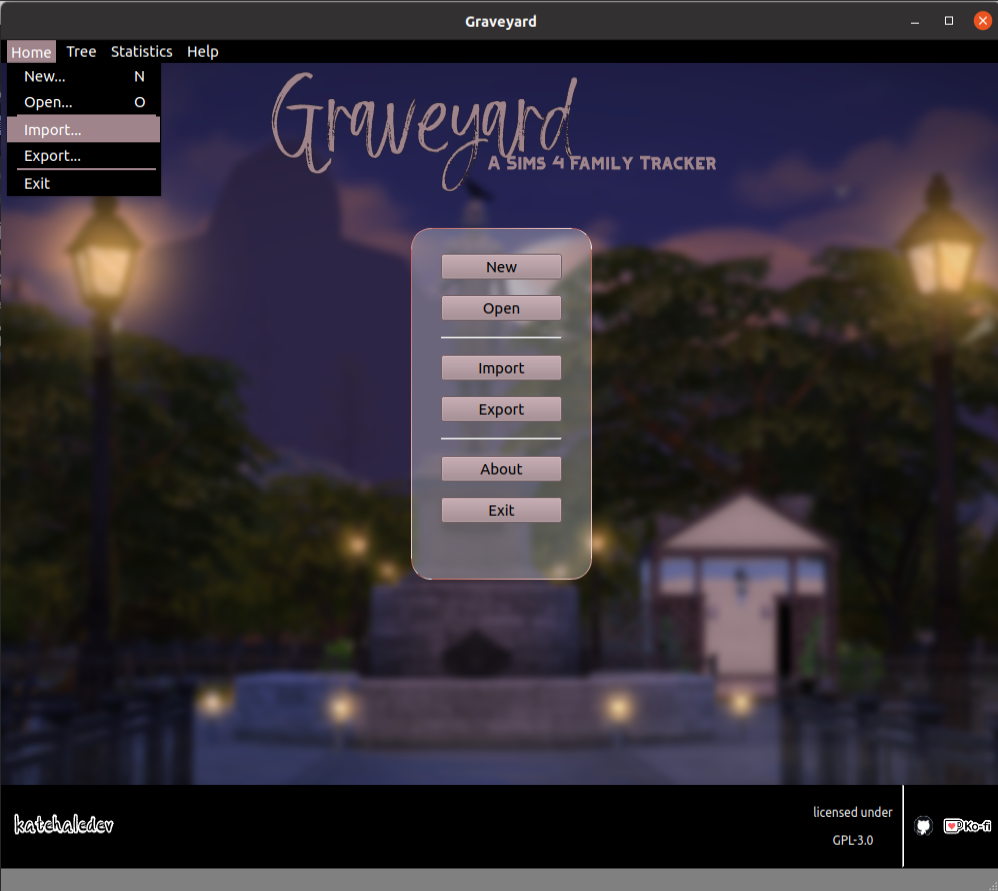

# 

  
## Welcome to Graveyard, a Sims 4 Family Tracker 

Graveyard is a companion desktop application for [The Sims 4](https://www.ea.com/games/the-sims). It allows players to track a variety of details about their Sims' families. **It is currently under active development and has not had an alpha release yet.**

### Alpha Features

- **Family tree** - view an entire legacy at once!
- **Family stats** - various stats about a family: number of members, number of alive and dead members, most common trait per age group, and more!
- **Collection tracker** - no more using spreadsheets to track your frog breeding or gardening hybrids!

### Pre-Alpha Teasers

The first version of the application pre-release, for your viewing pleasure:

#### Home View

### Technical Details

Graveyard is being developed using C++ & Qt 15.5.
Images are edited with [pixlr](https://pixlr.com).
Screenshots are taken from the [The Sims 4](https://www.ea.com/games/the-sims).

### Acknowledgements
Thank you to the following individuals for helping with the testing and development of Graveyard:

- [ambb205](https://github.com/ambb205)
- [4fmd](https://github.com/4fmd)
